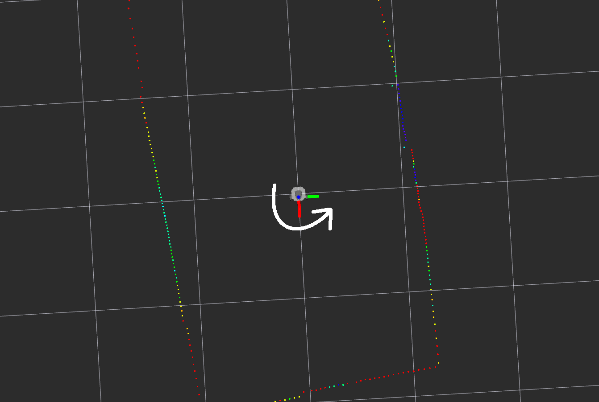

This guide describes how the parking demo works in both ros1 and ros2. The
demo consists of five stages:

## 1 Scan for the parking spot

The node looks at each of the lidar points and applies the function
(intensity^2 * range) to each of them, and looks for a set of at least ten
points in a row where this value is above some threshold. It then stores
three values: start_point is the first of these points, end_point is the
last of these points, and center_point is the midpoint between them.

## 2 First rotation

The robot then rotates until its orientation is parallel to the line between
start_point and end_point.

## 3 First move

Next, the robot drives forward or backward until its y axis lines up with
the center_point.

## 4 Second rotation

Then the robot rotates again until its orientation is perpendicular to the
line between start_point and end_point.

## 5 Second move

Finally, the robot moves again until its distance to center_point is below
some threshold.

# Troubleshooting

## The robot doesn't move, whether I run the automatic parking node or the teleop node

This can happen if you're using the same robot to run both ros1 and ros2
and you switch between them. Each version of ROS has its own version of
the OpenCR firmware that needs to be installed on the OpenCR board. The
setup scripts install this automatically, but if you're switching then
you might have the wrong version installed. In the **base_node_setup**
directory there are scripts called **reset_opencr_driver_ros1.sh** and
**reset_opencr_driver_ros2.sh**. Depending on whether you're running ros1 or
ros2, turn on the OpenCR board using the switch and execute the appropriate
script on the turtlebot.

## When running the parking demo, the robot just spins around aimlessly without ever moving forward

The robot is probably having trouble finding the parking
spot. This is where the rviz view can be useful. Both the
**mobsta_demo_ros1_image** and **mobsta_demo_ros2_image** directories have
a **turtlebot3_automatic_parking.rviz** configuration that you can load
(running the parking demo on the pc side will bring this up automatically)

An example of the rviz view is shown above-- the lidar scans are colored by
intensity, from red (lowest) to purple (highest), and the view also displays
three large white squares that indicate where it thinks the parking spot
is. Chances are you'll see these squares bouncing all over the room instead
of staying in a consistent spot, meaning that the intensities overall are
too high. Try moving to a room with darker walls, or even putting some tape
on the Lidar to reduce the intensities, or both.
