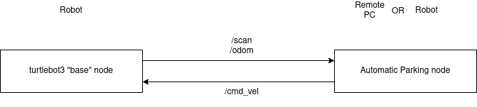

# Running and Replaying the Turtlebot3 Parking Demo in Ros1

## Intro

This is a simple-ish application that is meant to be a sort of
case study for integrating MOBSTA tools with ROS1. This demo uses the
[turtlebot3](https://emanual.robotis.com/docs/en/platform/turtlebot3/overview/)
robot and runs an application which uses the LIDAR to look for a
retroreflector, then drives the robot to park next to it.

There are two components to this demo. First, there’s a “base” node
that runs on the robot and is responsible for all the hardware stuff:
connecting to the sensor drivers, controlling the motors, etc. Second,
there is the "automatic parking" node itself which generates the velocity
commands. This second node can run on a remote PC, or on the robot itself.



I have a logging script that separates these out into different bag files
when recording, so the outputs from the “base” node are recorded to
a bag file called “sensor_inputs” and the outputs from the "automatic
parking" node are recorded to a bag called “control_outputs”, that way
hopefully it’s easier to replay and rerun stuff.

This directory **turtlebot-example** contains docker images for both
ROS1 and ROS2 that can run the parking node, record logs, and run MOBSTA on
those logs.

## Creating the docker images for MOBSTA

To run the MOBSTA example, we only need the node for the automatic parking 
demo. The rest of the code in this example folder is used for setting up 
the turtlebot and collecting logs, if you want to replicate the procedure 
from scratch. 

### Building the image

First, we need to install Docker if you do not already have it on 
your system. Follow the instructions on
`https://docs.docker.com/engine/install/ubuntu/` or whichever OS
you are using. 

The image is built using the script in the `parking_node_setup_pc`.

```
cd ./parking_node_setup_pc/
./build_ros1_image.sh
```

This builds a docker image called `mobsta_demo_ros1_image` with the 
automatic parking node inside. This does not contain any of the other 
code used to run the turtlebot, or the MOBSTA code.

At this point we are done with all the code needed to run the MOBSTA 
example. The next section outlines how to go about collecting your own log
if you want to go through the full setup, to provide some intuition on how
to use MOBSTA for your own system.

## Replicating the test procedure

While we provide example logs, if you wish to replicate the experiments 
from scratch and collect the logs yourself, the 
procedure below outlines how to setup a turtlebot for data collection and
collect the logs

### Setup the turtlebot to be able to run the Base node

This must be done on the turtlebot itself, since this is the node that connects
to the hardware and runs the drivers. The process described here was tested on
a turtlebot running an Ubuntu 22.04 image.

To create an SD card that can run things on the turtlebot, you can install a
standard Raspberry Pi image on it using the following steps:

1) Run Raspberry Pi Imager 
2) Click CHOOSE OS. 
3) Select Other gerneral-purpose OS. 
4) Select Ubuntu. 
5) Select Ubuntu Desktop 22.04.2 LTS (64-bit) that support RPi 3/4/400. 
6) Click CHOOSE STORAGE and select the micro SD card. 
7) Click WRITE to install

In the **base_node_setup** folder of the **turtlebot-example** directory, there
is a script called **setup_robot_ros1.sh**. Simply run this script on the
turtlebot OS.

**Note:**
When you first set up the OS when you turn the Raspberry Pi on, make sure
you have a WiFi connection and you enable Location Services when it asks,
because it needs that in order to synchronize the clock. The setup script
will fail if the system clock is behind.

### Checkout and build the docker image that runs the Automatic Parking node

To build the docker image that runs the automatic parking node, you need to
clone the **turtlebot-example** repo. You can do this either on a laptop
or on the turtlebot itself, the only difference is whether you use the scripts
in the **parking_node_setup_pc** folder or in the 
**parking_node_setup_turtlebot** folder.

``` 
cd turtlebot-example/parking_node_setup_pc   # or parking_node_setup_turtlebot
./build_ros1_image.sh 
```

To launch the image, there’s also a **launch_ros1_image.sh** script in
that same directory.

### To run the automatic parking demo   

There’s a few steps to this, and some of it is important to do in the right
order. We included a “cheat sheet” called “parking demo commands” in
the **turtlebot-example** directory inside the **mobsta_demo_ros1_image** directory.

The below steps all assume that you’re running the automatic parking node
on the remote PC, but you can also run that directly on the turtlebot. The
process is the same, you just ssh into the turtlebot to run the commands
instead of running them on a remote PC.

#### 1 Connect the robot and the remote PC to the same WiFi network

Plug in the monitor, mouse, and keyboard to connect the robot to a
network, and use ifconfig to get its IP address. 

After that you can unplug the monitor and everything. There’s a switch on
the “middle” layer of the robot for turning it on and off when it’s
not plugged in, and from here we’ll be doing everything via ssh.

#### 2 Start a roscore on the remote PC

Start up the docker image using the launch_ros1_image.sh script and run
“roscore.” Also, on the remote PC run ifconfig to get its IP address
(you’ll need that in the next step)

#### 3 Start up the robot

From the remote PC, ssh into the robot. If you used a different username 
during the turtlebot install, use that here Once logged in, run:

``` 
./startup_robot_ros1.sh <REMOTE PC IP ADDRESS> 
```

This starts up the robot “base” node described in the introduction. Here,
you’re giving it the IP of the remote PC, this is how it knows where the
ros master is running. If you're going to be running everything directly on
the turtlebot, give it the turtlebot's IP instead here. 

#### 4 Run rviz (optional) (PC Only)

You can then bring up the visualization if you want, this requires two
separate commands. The first command publishes a 3D model of the robot for
visualization and the second loads a custom rviz configuration that shows
the location of the robot and the lidar scans colored by intensity:

``` 
roslaunch turtlebot3_bringup turtlebot3_remote.launch 
```

``` 
rosrun rviz rviz -d `rospack find turtlebot3_automatic_parking`/rviz/turtlebot3_automatic_parking.rviz 
```

#### 5 Record a log

The turtlebot-example directory contains a **record_log.py** script for
convenience. Just navigate to the home direcotry inside the docker image
and run:

``` 
python3 record-log.py <optional log name> 
```

This will record the “sensor inputs” and “control outputs” bags to a
folder at $HOME/logs/Date/Log Name. Outside of the docker, it will create a
“logs” folder in the turtlebot-example directory, and all of the logs will be 
in there. If you don’t give it a log name, then it will convert the current 
time to a string and use that as the log name.

#### 6 Run the automatic parking node

Finally, you can start up the automatic parking node to start the demo:

``` 
roslaunch turtlebot3_automatic_parking turtlebot3_automatic_parking.launch
```

### To run teleop

There’s also a node you can run to control the robot using the wasd keys. To
do this, you still need to run the first three steps of the parking demo,
but instead of the automatic parking node, run:

``` 
roslaunch turtlebot3_teleop turtlebot3_teleop_key.launch 
```

**Note:**
Don’t run this at the same time as the automatic parking node, since they both 
publish to the same /cmd_vel channel. But you can Ctrl+C the automatic parking 
node and start this one without having to shut everything else down (and vice 
versa).
